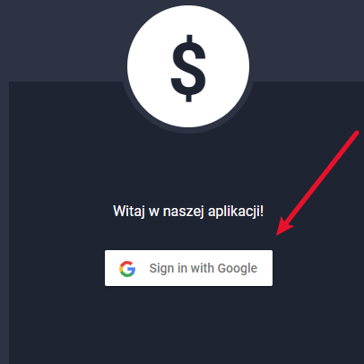
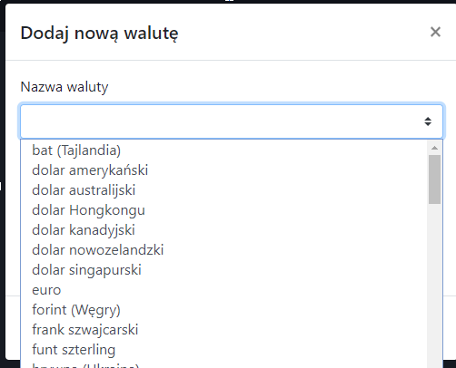
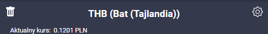
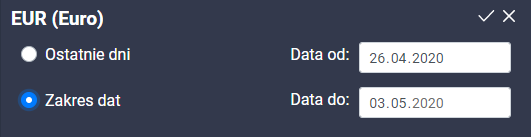
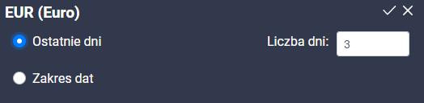
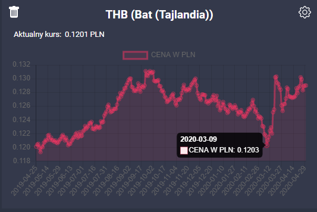
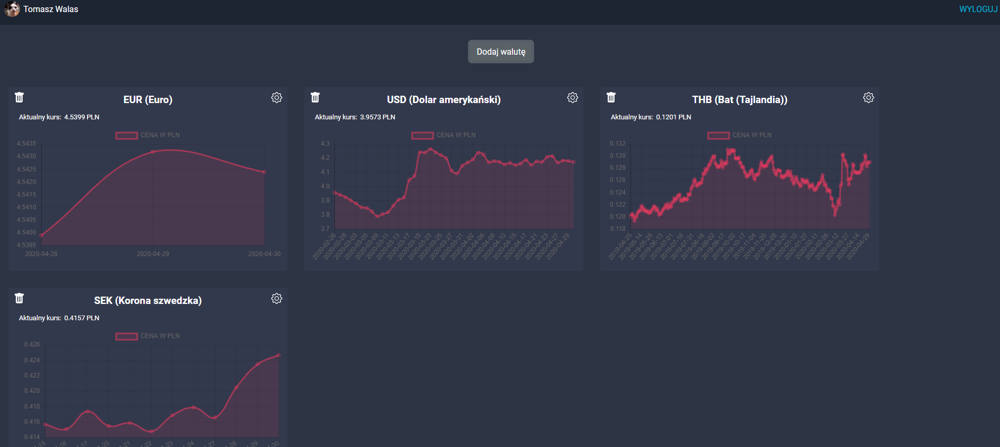
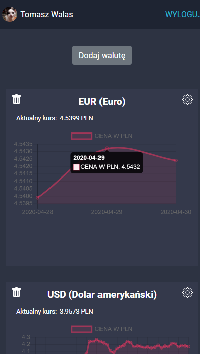

# Dokumentacja Currency App - Projekt BAI

## Wstęp - opis aplikacji
Aplikacja pozwala przy pomocy naszego konta Google na obserwacje dowolnej ilości walut z wybranej przez użytkownika ilości dni.

***

## Temat
Aplikacja do kontroli obcych walut

***

## Cele projektu:
Menedżer obcych walut, użytkownik w prosty sposób będzie mógł gromadzić interesujące go waluty, dodawać je do ulubionych oraz stale śledzić ich kurs. Dodatkową opcją będzie kontrola kursu waluty na przestrzeni czasu.

## Funkcjonalności:

**1. Autentykacja użytkownika za pomocą konta Google.**
Po wejściu do serwisu użytkownik zostaje poproszony o zalogowanie się:



**2. Wyszukiwanie walut.**
Po zalogowaniu użytkownik otrzymuje możliwość wyboru dowolnej waluty z określonej przez siebie ilości dni



**3. Kontrola obecnego kursu waluty**
Po wybraniu pojawi się informacja o aktualnym kursie waluty:



Możliwość wyboru z jakiej ilości dni chcemy pozyskać dane lub wybrać własny zakres dat:



**4. Kontrola kursu waluty na przestrzeni czasu (zobrazowana poprzez wykres)**
Po wybraniu pokazuje się wykres z określonego przedziału, po najechaniu widzimy stan z dowolnego dnia z wybranego wcześniej przedziału:



**5. Możliwość tworzenia oraz edycji list ulubionych walut**
Waluty zapisywane są do bazy firebase przez co użytkownik nie musi za każdym razem wyszukiwać swoich ulubionych walut.



**6. Możliwość zasilenia wirtualnego portfela**

**7. Możliwość wykonania przelewu gotówki do innego użytkownika**

**8. Możliwość zakupu dowolnej waluty z dostępnego salda**

**9. Wyświetlenie historii operacji na koncie**

**10. Dodanie możliwości  sprzedaży walut co zasila saldo na koncie**

**11. Wyświetlenie widżetów ze zmianami z zakupionych walut oraz możliwością wyświetlania danych w formie tabeli**

**12. Możliwość wygenerowania pdf'ów zarówno z pełnej historii konta jak i pełnej historii konkretnej waluty wybranej przez użytkownika**


## Wersja mobilna:



### [Link do aplikacji](http://bai.v50.pl/)
### [Link do projektu github](https://github.com/szymonzalega/currency-app)
### [Link do historii prowadzenia projektu](https://github.com/szymonzalega/currency-app/projects/2)

## Wykorzystane API
[Firebase](https://firebase.google.com/docs/reference?hl=pl)

[NBP](https://api.nbp.pl/)

## Wykorzystane technologie
* vue.js
* html
* css
* javascript

## Dodatkowe komponenty
* vue-chart-js

## Vue
* router-vue-router
* vuex
* bootstrap vue
* Vuelidate

### Package.json
```
{
  "name": "currency-app",
  "version": "0.1.0",
  "private": true,
  "scripts": {
    "predeploy": "yarn run build",
    "deploy": "gh-pages -b master -d build",
    "serve": "vue-cli-service serve",
    "build": "vue-cli-service build",
    "lint": "vue-cli-service lint"
  },
  "dependencies": {
    "axios": "^0.19.2",
    "bootstrap": "^4.4.1",
    "bootstrap-vue": "^2.11.0",
    "chart.js": "^2.9.3",
    "core-js": "^3.6.4",
    "firebase": "^7.14.0",
    "firebaseui": "^4.5.0",
    "gh-pages": "^2.2.0",
    "uuid": "^8.0.0",
    "vue": "^2.6.11",
    "vue-chartjs": "^3.5.0",
    "vue-router": "^3.1.6",
    "vuelidate": "^0.7.5",
    "vuex": "^3.1.3"
  },
  "devDependencies": {
    "@vue/cli-plugin-babel": "~4.3.0",
    "@vue/cli-plugin-eslint": "~4.3.0",
    "@vue/cli-plugin-router": "~4.3.0",
    "@vue/cli-service": "~4.3.0",
    "babel-eslint": "^10.1.0",
    "eslint": "^6.7.2",
    "eslint-plugin-vue": "^6.2.2",
    "node-sass": "^4.12.0",
    "sass-loader": "^8.0.2",
    "vue-template-compiler": "^2.6.11"
  }
}
```
