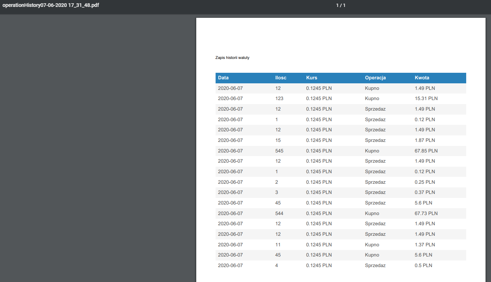

# Dokumentacja Currency App - Projekt BAI

## Wstęp - opis aplikacji
Aplikacja pozwala przy pomocy naszego konta Google na obserwacje dowolnej ilości walut z wybranej przez użytkownika ilości dni.

***

## Temat
Aplikacja do kontroli obcych walut

***

## Cele projektu:
Menedżer obcych walut, użytkownik w prosty sposób będzie mógł gromadzić interesujące go waluty, dodawać je do ulubionych oraz stale śledzić ich kurs. Dodatkową opcją będzie kontrola kursu waluty na przestrzeni czasu.

## Funkcjonalności:

**1. Autentykacja użytkownika za pomocą konta Google.**
Po wejściu do serwisu użytkownik zostaje poproszony o zalogowanie się:

**2. Wyszukiwanie walut.**
Po zalogowaniu użytkownik otrzymuje możliwość wyboru dowolnej waluty z określonej przez siebie ilości dni

**3. Kontrola obecnego kursu waluty**
Po wybraniu pojawi się informacja o aktualnym kursie waluty:

Możliwość wyboru z jakiej ilości dni chcemy pozyskać dane lub wybrać własny zakres dat:

**4. Kontrola kursu waluty na przestrzeni czasu (zobrazowana poprzez wykres)**
Po wybraniu pokazuje się wykres z określonego przedziału, po najechaniu widzimy stan z dowolnego dnia z wybranego wcześniej przedziału:

**5. Możliwość tworzenia oraz edycji list ulubionych walut**
Waluty zapisywane są do bazy firebase przez co użytkownik nie musi za każdym razem wyszukiwać swoich ulubionych walut.

**Możliwość tworzenia oraz edycji list ulubionych walut**

**6. Możliwość zasilenia wirtualnego portfela**

**7. Możliwość wykonania przelewu gotówki do innego użytkownika**

**8. Możliwość zakupu dowolnej waluty z dostępnego salda**

**9. Wyświetlenie historii operacji na koncie**

**10. Dodanie możliwości  sprzedaży walut co zasila saldo na koncie**

**11. Wyświetlenie widżetów ze zmianami z zakupionych walut oraz możliwością wyświetlania danych w formie tabeli**

**12. Możliwość wygenerowania pdf'ów zarówno z pełnej historii konta jak i pełnej historii konkretnej waluty wybranej przez użytkownika**

## Wersja mobilna:

### [Link do aplikacji](http://bai.v50.pl/)
### [Link do projektu github](https://github.com/szymonzalega/currency-app)
### [Link do historii prowadzenia projektu](https://github.com/szymonzalega/currency-app/projects/2)

## Wykorzystane API
[Firebase](https://firebase.google.com/docs/reference?hl=pl)

[NBP](https://api.nbp.pl/)

## Wykorzystane technologie
* vue.js
* html
* css
* javascript

## Dodatkowe komponenty
* vue-chart-js
* jsPDF

## Vue
* router-vue-router
* vuex
* bootstrap vue
* Vuelidate
